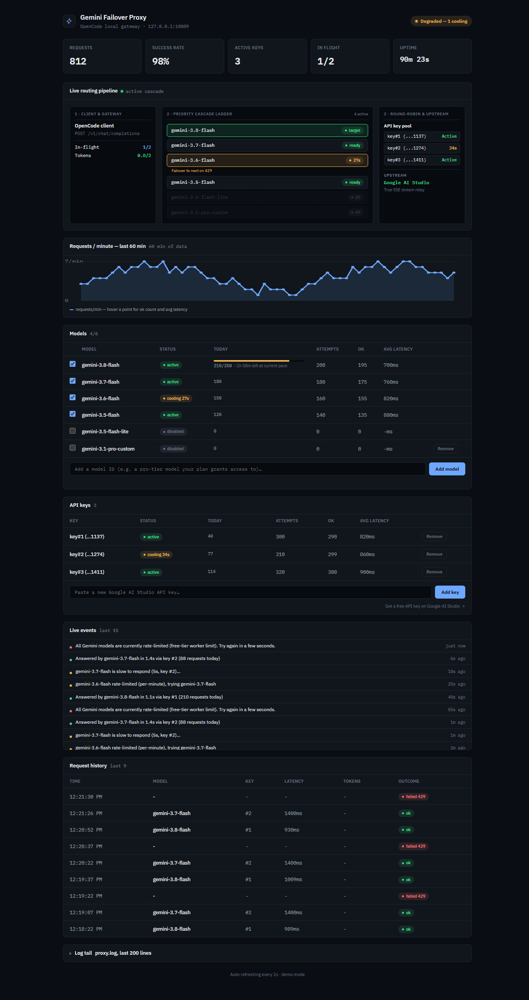
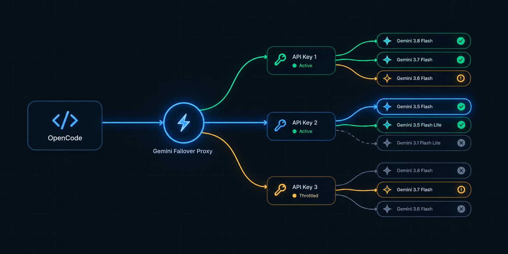

# OpenCode Gemini Failover Proxy

A zero-dependency, OpenAI-compatible failover proxy that sits between OpenCode and Google Gemini AI Studio's free tier, so one 429 doesn't abort your agent run.

[](https://github.com/mk-elbaz/opencode-gemini-proxy/actions/workflows/test.yml)
<!-- restore after `npm publish`: [](https://www.npmjs.com/package/opencode-gemini-proxy) -->
[](LICENSE)




A light-theme screenshot is also in `assets/` (`dashboard-light.png`).

## Why

- A free-tier 429 on your one model/key aborts the whole OpenCode agent run, mid-task.
- One Gemini model and one API key is not enough headroom to code against all day.
- When something does fail, you have no visibility into which model, which key, or why.

## Quick start

```bash
npx opencode-gemini-proxy init
npx opencode-gemini-proxy
```

Then restart OpenCode (or start a new session) and pick `google/gemini-3.8-flash` as your model.

`init` is interactive: it asks for a Google AI Studio API key (validating it against Google unless `--skip-key-check` is passed), writes it to `.env` in the proxy's data directory, merges a `provider.google` block into `~/.config/opencode/opencode.json` (backing up the existing file first if one exists), and installs the OpenCode TUI plugin to `~/.config/opencode/plugins/gemini-proxy.js`. Run `npx opencode-gemini-proxy init --help`-equivalent flags below for non-interactive use.

Get a free key at [aistudio.google.com/apikey](https://aistudio.google.com/apikey).

<details>
<summary>Manual setup (git clone, no npx)</summary>

```bash
git clone https://github.com/mk-elbaz/opencode-gemini-proxy.git
cd opencode-gemini-proxy
```

Copy the example env file and add your key:

**Windows (PowerShell):**
```powershell
Copy-Item .env.example .env
notepad .env
```

**macOS / Linux:**
```bash
cp .env.example .env
nano .env
```

```env
PROXY_PORT=8085
GOOGLE_API_KEY_1=your_api_key_here
```

Run it:

```bash
npm start
```

Then add the provider block to your OpenCode config (`~/.config/opencode/opencode.json` on macOS/Linux, `%USERPROFILE%\.config\opencode\opencode.json` on Windows):

```json
{
  "provider": {
    "google": {
      "npm": "@ai-sdk/openai-compatible",
      "name": "Google Auto-Failover Proxy (Local)",
      "options": {
        "baseURL": "http://localhost:8085/v1"
      },
      "models": {
        "gemini-3.8-flash": { "name": "Gemini 3.8 Flash (Auto-Failover)", "multimodal": true, "reasoning": true, "tool_call": true },
        "gemini-3.7-flash": { "name": "Gemini 3.7 Flash (Auto-Failover)", "multimodal": true, "reasoning": true, "tool_call": true },
        "gemini-3.6-flash": { "name": "Gemini 3.6 Flash (Auto-Failover)", "multimodal": true, "reasoning": true, "tool_call": true },
        "gemini-3.5-flash": { "name": "Gemini 3.5 Flash (Auto-Failover)", "multimodal": true, "reasoning": true, "tool_call": true },
        "gemini-3.5-flash-lite": { "name": "Gemini 3.5 Flash Lite (Auto-Failover)", "multimodal": true, "reasoning": true, "tool_call": true },
        "gemini-3.1-flash-lite": { "name": "Gemini 3.1 Flash Lite (Auto-Failover)", "multimodal": true, "reasoning": true, "tool_call": true }
      }
    }
  },
  "model": "google/gemini-3.8-flash",
  "small_model": "google/gemini-3.5-flash-lite"
}
```

No `apiKey` field is needed — the proxy holds your real Google key(s) and OpenCode never sees them.

</details>

## What you see in OpenCode

Two independent channels report what the proxy is doing, and neither requires you to leave your editor:

**In-stream status lines.** With `PROXY_STATUS=reasoning` (the default), the proxy writes short status lines into `reasoning_content`, which OpenCode renders in its dim "thinking" block. Examples of the actual strings it sends:

```
[gemini-proxy] gemini-3.6-flash is slow to respond (5s, key #1)…
[gemini-proxy] gemini-3.6-flash rate-limited (per-minute), trying gemini-3.5-flash
[gemini-proxy] All models rate-limited, holding request, next slot in 42s
[gemini-proxy] Daily quota hit on all models, holding until Pacific midnight (3h14m). Add a key at http://localhost:8085
```

OpenCode replays `reasoning_content` back as history on the next turn — the proxy strips its own `[gemini-proxy] ` lines out of that replayed history first, so they never get fed back to the model as if it had "thought" them. Set `PROXY_STATUS=content` to write these into the visible answer text instead, or `off` to disable.

**TUI toasts.** The OpenCode plugin in `opencode-plugin/` shows native toast notifications for model switches, slow responses, rate-limit waits, daily quota hits, key rejections, and failed requests, plus a proxy-health check when a session goes idle. It's a passive observer of `GET /api/events` and `GET /health` — it doesn't affect routing. `init` installs it automatically; to install it by hand, copy `opencode-plugin/gemini-proxy.js` to `~/.config/opencode/plugins/` (global) or `.opencode/plugins/` (per-project).

## Features

- **Multi-model fallback cascade** across Google's Gemini flash lineup (`gemini-3.8-flash` down to `gemini-3.1-flash-lite`).
- **Multi-key round-robin pooling** — each added key multiplies the effective quota pool.
- **Daily quota tracking with Pacific reset** — detects RPD vs RPM 429s and parks the affected model/key until Google's actual daily reset (midnight Pacific, not UTC).
- **Thought-signature escape hatch** — injects Google's documented sentinel into replayed tool calls so OpenCode subagent tool loops don't 400.
- **True SSE streaming relay** with `[DONE]` synthesis and mid-stream error detection.
- **Scope-aware exhaustion** — per-model quotas rotate to the next model on the same key; key-wide limits park the whole key too.
- **Wait-for-quota** — holds a request open with SSE keepalives instead of returning a 429 (which aborts the OpenCode run), configurable via `PROXY_WAIT_FOR_QUOTA` / `PROXY_MAX_WAIT_HOURS`.
- **Self-healing watchdog** — `watchdog.vbs` (Windows) / `watchdog.sh` (macOS/Linux) restart the proxy within seconds if it ever exits.
- **Honors Google's `retryDelay`** — when a 429 carries an explicit `RetryInfo`/`Retry-After`, the proxy cools for that exact duration instead of guessing.
- **Learned daily limits with pace forecast** — since Google doesn't publish per-key RPD limits, the proxy learns the request count that tripped a daily 429 and forecasts, in `/metrics`, when each model will hit it again at the current request rate.
- **Token accounting** — prompt/completion/total tokens tracked per key, per model, and cumulatively, including today's tokens.
- **Key validation on add** — a new key is checked against Google before it's accepted, whether added via `.env`, the CLI, or the dashboard.
- **Live event stream** (`GET /api/events`, SSE) — the same events that drive in-stream status and TUI toasts, consumable by any client.
- **Request history** — recent completed requests (model, key, latency, outcome) in the dashboard.
- **Log tail** (`GET /api/logs`) — the last N lines of `proxy.log`, with any stray key text masked.
- **Light theme, and demo mode** for the dashboard (see below).
- **Admin token** (`PROXY_ADMIN_TOKEN`) — required if you bind the dashboard/API beyond loopback.
- **Docker** support with a persistent data volume.
- **Zero external dependencies** — pure Node.js built-ins.

## Dashboard

Visit `http://localhost:8085` (or wherever `PROXY_PORT` points). Panels: KPI row (requests, success rate, active keys, in-flight, uptime); a live routing-pipeline visualizer showing the client/gateway stage, the model cascade, and the key pool as requests flow through; a requests-per-minute sparkline for the last 60 minutes; a models table (attempts, cooldowns, daily usage, tokens, enable/disable, add custom model); an API keys table (masked key, cooldown state, daily usage, add/remove); a live events feed; a request history table; and a collapsible log tail.

Query parameters: `?demo=1` renders the dashboard with synthetic data and a fake event stream, useful for previewing without a running proxy or real traffic. `?theme=light` or `?theme=dark` forces a theme regardless of system preference. `?token=...` supplies the admin token when `PROXY_ADMIN_TOKEN` is set — it's stored in `sessionStorage` and stripped from the URL after first load.

## Configuration

All variables live in `.env` (see `.env.example`); the dashboard and CLI write to the same file.

| Variable | Default | Meaning |
|---|---|---|
| `PROXY_PORT` | `8085` | Port the proxy listens on. |
| `PROXY_DATA_DIR` | see below | Where `.env` / `usage.json` / `proxy.log` live. |
| `GOOGLE_API_KEY_1`, `GOOGLE_API_KEY_2`, ... | none | Numbered Google AI Studio API keys; add more slots to multiply your quota pool. |
| `GOOGLE_ENABLED_MODELS` | all supported models | Comma-separated subset/order of models to use for failover. |
| `PROXY_WAIT_FOR_QUOTA` | `true` | Hold requests open until quota returns instead of failing fast with 429; set to `false` for the old fail-fast behavior. |
| `PROXY_MAX_WAIT_HOURS` | `24` | Give up holding a request after this long. |
| `PROXY_STATUS` | `reasoning` | Where in-stream status lines go: `reasoning` (thinking block), `content` (visible answer text), or `off`. |
| `PROXY_SKIP_KEY_CHECK` | `false` | Skip validating a new key against Google before adding it (useful offline or in tests). |
| `PROXY_DISCOVERY_HOURS` | `6` | How often the proxy checks Google's model list for new/retired Gemini models. `0` disables the recurring check. |
| `PROXY_AUTO_ENABLE_NEW_MODELS` | `false` | Auto-enable newly discovered models instead of leaving them unchecked. Changes your failover cascade without asking — off by default. |
| `PROXY_HOST` | `127.0.0.1` | Interface to bind to. Anything other than loopback requires `PROXY_ADMIN_TOKEN`. |
| `PROXY_ADMIN_TOKEN` | none | Bearer token guarding `/api/*` and `/metrics` (also accepted as `?token=` for `/api/events`); required if `PROXY_HOST` is non-loopback. |

### Model discovery

Instead of relying solely on the hardcoded default model list, the proxy periodically asks Google's own `GET /v1beta/models` for the current Gemini lineup (`discovery.js`) — once ~3s after startup, then every `PROXY_DISCOVERY_HOURS` (default 6h), after a key is added, or on demand via the dashboard's "Refresh from Google" button or `POST /api/models/discover`. Newly-seen models land in the catalog unchecked (a `new` badge in the dashboard) so a bad or preview model never joins your failover cascade unannounced; set `PROXY_AUTO_ENABLE_NEW_MODELS=true` to enable them automatically instead. Catalog models Google stops listing get an `unlisted` badge but are never auto-disabled, since they may keep working for a while. A failed check (network error, bad key) just logs and retries next cycle — it never crashes the proxy or blocks a request.

Data directory rules (`paths.js`):

- If `PROXY_DATA_DIR` is set, it always wins.
- Otherwise, if a `.env` already sits next to `server.js` (a git checkout), that folder is used — today's behavior, unchanged.
- Otherwise (an npm/npx install with no local `.env`), it falls back to `~/.config/opencode-gemini-proxy` — the same OS-config convention OpenCode itself uses.

## CLI reference

```
opencode-gemini-proxy [start]        run the proxy
opencode-gemini-proxy init [opts]    one-time interactive setup
opencode-gemini-proxy doctor         environment/health report
```

`init` options:

- `--key <key>` — Google AI Studio API key, skips the prompt.
- `--port <n>` — proxy port (default `8085`).
- `--yes`, `-y` — accept defaults, skip confirmations (requires `--key`).
- `--no-opencode` — don't touch `~/.config/opencode/opencode.json`.
- `--no-plugin` — don't install the OpenCode TUI plugin.
- `--skip-key-check` — don't validate the key against Google before saving.

`doctor` prints Node/platform info, the resolved data directory, `.env` presence and masked key count, a live `/health` check against a running proxy, whether `opencode.json` has the provider block, whether the plugin is installed, and the last 50 log lines (keys masked).

`--help` / `-h` prints command usage.

## Endpoints

- `GET /` — web dashboard.
- `GET /v1/models` — models currently in the failover rotation.
- `POST /v1/chat/completions` — OpenAI-compatible chat completion endpoint with automatic failover.
- `GET /health` — liveness check, active cooling states, key counts, in-flight request counters.
- `GET /metrics` — per-model/per-key telemetry: attempts, successes, cooldowns, daily usage, token counts, latencies, and the daily-limit forecast. **Requires the admin token** if `PROXY_ADMIN_TOKEN` is set.
- `GET /api/events` — SSE event stream (optionally `?since=<ms>` to replay from a timestamp). Event types: `model_switch`, `slow_response`, `waiting`, `quota_daily`, `key_rejected`, `request_failed`, `request_done`, `models_discovered`. **Requires the admin token** (via `?token=`) if set.
- `GET /api/logs?n=<count>` — last `n` lines (default 200, max 1000) of `proxy.log`, key material masked. **Requires the admin token** if set.
- `GET /api/config` — current keys (masked) and enabled/available models. **Requires the admin token** if set.
- `POST /api/keys` `{ "key": "..." }` — add an API key (validated against Google first). **Requires the admin token** if set.
- `DELETE /api/keys/:id` — remove an API key (at least one must remain). **Requires the admin token** if set.
- `PUT /api/models` `{ "models": [...] }` — set which models are in the failover rotation. **Requires the admin token** if set.
- `POST /api/models` `{ "model": "..." }` — add a custom model ID to the catalog. **Requires the admin token** if set.
- `DELETE /api/models/:id` — remove a custom model (built-ins can't be removed). **Requires the admin token** if set.
- `POST /api/models/discover` — check Google's model list now and update the catalog; returns `{ ok, added, removed, catalog }`. **Requires the admin token** if set.

`GET /`, `/v1/*`, and `/health` stay open even with an admin token set, so OpenCode itself never needs one.

## Docker

```bash
docker compose up -d
```

`docker-compose.yml` builds the image, sets `PROXY_HOST=0.0.0.0` (needed for the container's port mapping to reach the process at all) together with the `PROXY_ADMIN_TOKEN` requirement that non-loopback binding enforces, reads your `.env` file for the API key(s), and mounts a named volume at `/app/data` (where the Dockerfile points `PROXY_DATA_DIR`) so `.env`, `usage.json`, and `proxy.log` survive container recreation.

## Works with other clients

The proxy exposes a standard OpenAI-compatible `/v1/chat/completions` and `/v1/models` API, so any client that lets you point at a custom base URL — Cursor, Cline, Continue, Aider, Zed, and others — can use `http://localhost:8085/v1` the same way OpenCode does. That said, this project is built and tested against OpenCode specifically (the in-stream status lines and TUI plugin are OpenCode-specific extras); it has not been tested with other clients.

## How it works



- A token bucket paces outbound requests to a conservative rate, independent of any 429 — it slows down before Google does.
- The proxy picks the next healthy model in the configured cascade (`pickModel`), skipping any still cooling down.
- It picks the next healthy key in round-robin order (`pickKey`) from the pool.
- The attempt runs under a timeout guard (TTFT, idle-chunk, and total-attempt budgets) so a hung upstream call doesn't stall the whole request.
- A 429 (or 403) response is classified by scope and duration: per-model vs key-wide, and daily (RPD) vs short (RPM), using Google's quota metadata and `retryDelay` when present.
- The proxy cools the affected model (and the key too, if the exhaustion was key-wide) and rotates to the next candidate — never mid-stream, only before the first byte reaches the client.
- If every model and key are cooling, the proxy holds the request open with SSE keepalives (wait-for-quota) rather than failing the run, up to `PROXY_MAX_WAIT_HOURS`.
- Once an attempt succeeds, its response is relayed to the client verbatim — SSE events forwarded line-by-line, `[DONE]` synthesized if missing, tool-call fields patched for OpenAI-spec compliance.

## Auto-restart

The proxy is a single long-running process. To survive a crash or reboot without noticing:

- **Windows**: copy `watchdog.vbs` into your Startup folder (<kbd>Win</kbd>+<kbd>R</kbd>, `shell:startup`) to auto-start at login, or double-click it to start it hidden right now.
- **macOS / Linux**: run `./watchdog.sh` in the background (`nohup ./watchdog.sh >/dev/null 2>&1 &`), or wrap it in a `systemd --user` unit / `launchd` plist — see the comments at the top of `watchdog.sh`.

## Development

```bash
node test.js
```

Node's built-in test runner, no framework, no extra dependencies. See [CONTRIBUTING.md](./CONTRIBUTING.md) for where things live and the zero-dependency rule.

## Security

See [SECURITY.md](./SECURITY.md) for the threat model and how to report a vulnerability.

## License

MIT
